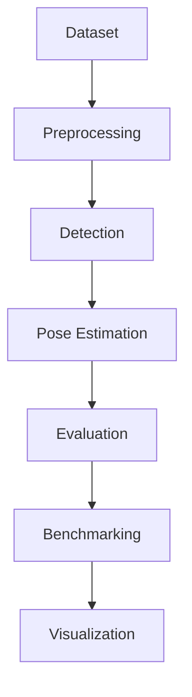

# BrushPose AI
### Toothbrush Detection and 2D Pose Estimation for Tabletop Computer Vision

Industrial-grade computer vision pipeline for object localization and orientation estimation in controlled tabletop scenes.

[](#installation)
[](#features)
[](#training)
[](#license)
[](#roadmap)
[](#installation)
[](#)

> Precision-first CV engineering for spatial reasoning on tabletop scenes.

---

## Quick Links
- [Unified CLI](src/cli.py)
- [Classical CV Runner](scripts/run_classical_cv.py)
- [Benchmark Runner](scripts/run_benchmark.py)
- [Русская версия README](README_RU.md)
- [English Documentation](#english-documentation)

## English Documentation
- [Architecture](docs/en/architecture.md)
- [Dataset Preparation](docs/en/dataset_preparation.md)
- [YOLO Training](docs/en/yolo_training.md)
- [Evaluation](docs/en/evaluation.md)
- [Benchmarking](docs/en/benchmarking.md)
- [Mathematical Model](docs/en/math_model.md)
- [Final Report Template](docs/en/final_report.md)

## Table of Contents
- [Project Overview](#project-overview)
- [Problem Statement](#problem-statement)
- [Features](#features)
- [Project Architecture](#project-architecture)
- [Demo](#demo)
- [Dataset Structure](#dataset-structure)
- [Installation](#installation)
- [Quick Start](#quick-start)
- [Training](#training)
- [Inference](#inference)
- [Evaluation](#evaluation)
- [Metrics](#metrics)
- [Visualization and Results](#visualization-and-results)
- [Roadmap](#roadmap)
- [Command Examples](#command-examples)
- [License](#license)

---

## Project Overview
BrushPose AI detects a toothbrush in top-view RGB images, estimates object center coordinates \((x_{center}, y_{center})\), and predicts axial orientation angle \(\theta \in [0^\circ, 180^\circ)\).

The repository combines:
- classical CV (HSV segmentation + contour geometry)
- YOLOv8 detection
- reproducible evaluation and benchmarking
- portfolio-ready visual artifacts and reports

## Problem Statement
**Input**: RGB images (single frame or batch) from tabletop scenes.  
**Output**: bounding box, center point, orientation angle, visualization overlays, and metrics.

Key technical challenges:
- illumination variability and specular highlights
- low object/background contrast
- contour instability for elongated thin shapes
- axial ambiguity in orientation definition

## Features
- Toothbrush detection in controlled scenes
- Center localization and orientation estimation
- Classical CV pipeline (`minAreaRect` + PCA orientation)
- YOLOv8 pipeline (training + inference)
- Unified CLI (`python src/cli.py ...`)
- Dataset preparation and validation tools
- Evaluation subsystem with report generation
- Multi-method benchmarking
- Visualization utilities for overlays and metric plots
- Bilingual documentation (English + Russian)

## Project Architecture


Module map:
- `src/data`: collection templates, validation, split, annotation conversion
- `src/pose`: classical CV and geometry logic
- `src/detection`: YOLO export/train/inference
- `src/evaluation`: metrics, evaluator, report generator
- `src/visualization`: rendering and plotting utilities
- `scripts/`: benchmark and runner wrappers

Architecture placeholder: `assets/pipeline.png`

## Demo
- Demo GIF: `assets/demo.gif`
- Prediction example: `assets/prediction_example.png`
- Orientation overlay: `assets/pca_orientation_example.png`
- Benchmark chart: `assets/benchmark_plot.png`

## Dataset Structure
```text
data/
├── raw/
├── images/
├── annotations/
├── train/
│   ├── images/
│   └── labels/
├── val/
│   ├── images/
│   └── labels/
└── test/
    ├── images/
    └── labels/
```

## Installation
```bash
git clone https://github.com/<your-org>/BrushPoseAI.git
cd BrushPoseAI
python -m venv .venv
# Windows: .venv\Scripts\Activate.ps1
# Linux/macOS: source .venv/bin/activate
pip install --upgrade pip
pip install -r requirements.txt
```

## Quick Start
```bash
python src/cli.py prepare-data --mode validate \
  --images-dir data/images \
  --annotations data/annotations/annotations.csv

python src/cli.py run-classical \
  --input data/test/images \
  --output outputs/images/classical_cv \
  --csv-out outputs/metrics/classical_cv_predictions.csv \
  --angle-method pca

python src/cli.py infer \
  --method yolo \
  --weights runs/brushpose_yolo/train/weights/best.pt \
  --input data/test/images \
  --output-dir outputs/images/yolo \
  --csv-out outputs/metrics/yolo_predictions.csv
```

## Training
```bash
python src/cli.py prepare-data --mode export-yolo \
  --images-dir data/images \
  --annotations data/annotations/annotations.csv \
  --output-dir data/yolo_dataset

python src/cli.py train-yolo \
  --data data/yolo_dataset/dataset.yaml \
  --model yolov8n.pt \
  --epochs 50 \
  --imgsz 640 \
  --batch 8 \
  --validate
```

## Inference
```bash
python src/cli.py infer \
  --method classical \
  --input data/test/images \
  --output-dir outputs/images/classical \
  --csv-out outputs/metrics/classical_predictions.csv \
  --angle-method pca

python src/cli.py infer \
  --method yolo \
  --weights runs/brushpose_yolo/train/weights/best.pt \
  --input data/test/images \
  --output-dir outputs/images/yolo \
  --csv-out outputs/metrics/yolo_predictions.csv
```

## Evaluation
```bash
python src/cli.py evaluate \
  --ground-truth data/test/labels/annotations.csv \
  --predictions outputs/metrics/classical_predictions.csv \
  --output-dir outputs/reports/classical_eval \
  --method-name classical_pca \
  --report-format both
```

## Metrics
\[
\mathrm{IoU} = \frac{|B_{pred}\cap B_{gt}|}{|B_{pred}\cup B_{gt}|}
\]

\[
e_c = \sqrt{(x_{pred}-x_{gt})^2 + (y_{pred}-y_{gt})^2}
\]

\[
e_\theta = \min\left(|\theta_{pred}-\theta_{gt}|,\ 180^\circ-|\theta_{pred}-\theta_{gt}|\right)
\]

Primary KPIs:
- detection accuracy
- IoU and `map_50_proxy`
- center error (px)
- angle error (deg)
- processing time and FPS

## Visualization and Results
Expected output artifacts:
- overlays with bbox, center, orientation, confidence
- per-sample evaluation CSV and summary JSON
- benchmark comparison report and plots

Placeholders:
- `assets/dataset_example.png`
- `assets/classical_prediction.png`
- `assets/yolo_detection.png`
- `assets/benchmark_plot.png`
- `assets/error_analysis.png`

## Roadmap
- [x] Classical CV pose estimation pipeline
- [x] YOLO training and inference integration
- [x] Evaluation subsystem with geometric metrics
- [x] Multi-method benchmark orchestration
- [ ] Rotated bounding boxes (OBB)
- [ ] Segmentation-enhanced orientation estimation
- [ ] ROS2 integration
- [ ] TensorRT acceleration
- [ ] Real-time streaming pipeline
- [ ] Synthetic data augmentation workflow
- [ ] Dockerized reproducible runtime

## Limitations
- Classical segmentation is sensitive to lighting/background drift
- Orientation may degrade on partially occluded objects
- Detection quality depends on data diversity and annotation quality

## Command Examples
```bash
# collect template annotations from raw data
python src/cli.py prepare-data --mode collect \
  --input-dir data/raw \
  --images-dir data/images \
  --annotations data/annotations/annotations.csv

# split dataset
python src/cli.py prepare-data --mode split \
  --images-dir data/images \
  --annotations data/annotations/annotations.csv \
  --output-dir data \
  --format both

# benchmark
python src/cli.py benchmark \
  --images-dir data/test/images \
  --ground-truth data/test/labels/annotations.csv \
  --output-dir outputs \
  --yolo-weights runs/brushpose_yolo/train/weights/best.pt \
  --methods classical_min_area_rect classical_pca yolo_geometric \
  --language both \
  --skip-yolo-if-missing

# generate final report
python src/cli.py generate-report \
  --benchmark-results outputs/metrics/benchmark_results.csv \
  --metrics-dir outputs/metrics/benchmark \
  --output outputs/reports/final_report_en.md \
  --language en
```

## FAQ
<details>
<summary>Why does YOLO angle metric show as unavailable in some reports?</summary>
Standard YOLO detection predicts boxes/confidence/classes. Angle metrics are unavailable unless a geometric angle post-process is provided.
</details>

<details>
<summary>Why can classical CV fail on certain images?</summary>
HSV segmentation is sensitive to illumination, shadows, and low contrast. Tune `hsv_lower`, `hsv_upper`, and morphology parameters in `configs/config.yaml`.
</details>

## Reproducibility
- Run all commands from repository root.
- Use `configs/config.yaml` for stable defaults.
- Keep train/val/test splits fixed with `--seed`.
- Store metrics and reports under `outputs/`.

## License
Released under the MIT License. See [LICENSE](LICENSE).

## Acknowledgements
- [OpenCV](https://opencv.org/)
- [Ultralytics](https://github.com/ultralytics/ultralytics)
- [NumPy](https://numpy.org/)
- [pandas](https://pandas.pydata.org/)
- [matplotlib](https://matplotlib.org/)
