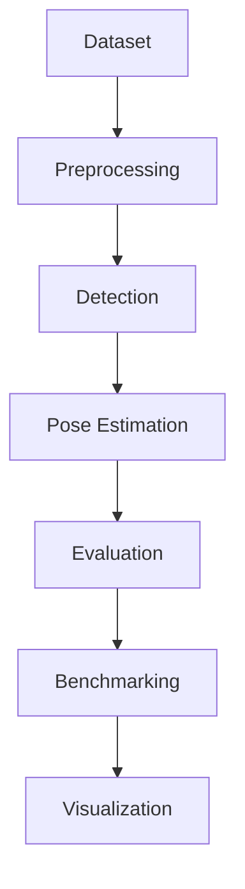

# BrushPose AI
### Детекция зубной щетки и оценка 2D-позы в tabletop-сценах

Инженерный репозиторий по компьютерному зрению для локализации объекта и оценки его ориентации по RGB-изображениям верхнего ракурса.

[](#установка)
[](#функциональные-возможности)
[](#обучение)
[](#лицензия)
[](#roadmap)
[](#установка)
[](#)

> Практико-ориентированный CV-конвейер для задач пространственной локализации и инженерной оценки позы.

---

## Быстрые ссылки
- [Единый CLI](src/cli.py)
- [Скрипт classical CV](scripts/run_classical_cv.py)
- [Скрипт бенчмарка](scripts/run_benchmark.py)
- [English README](README.md)
- [Русская документация](#русская-документация)

## Русская документация
- [Архитектура](docs/ru/architecture.md)
- [Подготовка датасета](docs/ru/dataset_preparation.md)
- [Обучение YOLO](docs/ru/yolo_training.md)
- [Оценка качества](docs/ru/evaluation.md)
- [Бенчмаркинг](docs/ru/benchmarking.md)
- [Математическая модель](docs/ru/math_model.md)
- [Шаблон финального отчета](docs/ru/final_report.md)

## Содержание
- [Обзор проекта](#обзор-проекта)
- [Постановка задачи](#постановка-задачи)
- [Функциональные возможности](#функциональные-возможности)
- [Архитектура проекта](#архитектура-проекта)
- [Demo](#demo)
- [Структура датасета](#структура-датасета)
- [Установка](#установка)
- [Быстрый старт](#быстрый-старт)
- [Обучение](#обучение)
- [Инференс](#инференс)
- [Оценка качества](#оценка-качества)
- [Метрики](#метрики)
- [Визуализация и результаты](#визуализация-и-результаты)
- [Roadmap](#roadmap)
- [Примеры команд](#примеры-команд)
- [Лицензия](#лицензия)

---

## Обзор проекта
BrushPose AI решает задачу детекции зубной щетки на рабочей поверхности и оценки:
- координат центра объекта \((x_{center}, y_{center})\)
- угла ориентации \(\theta \in [0^\circ, 180^\circ)\)

Система объединяет:
- классические методы CV (HSV-сегментация, контуры, геометрия)
- детекцию на базе YOLOv8
- воспроизводимый контур оценки и бенчмаркинга

## Постановка задачи
**Вход**: RGB-изображения сцены (одиночные или пакет).  
**Выход**: bounding box, центр объекта, угол ориентации, визуализация предсказаний и метрики.

Основные источники ошибок:
- вариативность освещения и блики
- недостаточный контраст объект/фон
- нестабильность контуров для тонких вытянутых объектов
- осевая неоднозначность угла ориентации

## Функциональные возможности
- Детекция зубной щетки в tabletop-сценах
- Локализация центра и оценка угла
- Classical CV pipeline (`minAreaRect` и PCA)
- YOLOv8: экспорт датасета, обучение, инференс
- Единый CLI-интерфейс
- Подсистема оценки качества и генерации отчетов
- Многометодный бенчмарк
- Визуализация предсказаний и метрик
- Двуязычная техническая документация

## Архитектура проекта


Карта модулей:
- `src/data`: подготовка и валидация датасета
- `src/pose`: classical CV и геометрические функции
- `src/detection`: YOLO export/train/infer
- `src/evaluation`: метрики и генерация отчетов
- `src/visualization`: отрисовка и графики
- `scripts/`: orchestration-скрипты

Плейсхолдер схемы: `assets/pipeline.png`

## Demo
- Demo GIF: `assets/demo.gif`
- Пример детекции: `assets/prediction_example.png`
- Визуализация PCA-ориентации: `assets/pca_orientation_example.png`
- График сравнения методов: `assets/benchmark_plot.png`

## Структура датасета
```text
data/
├── raw/
├── images/
├── annotations/
├── train/
│   ├── images/
│   └── labels/
├── val/
│   ├── images/
│   └── labels/
└── test/
    ├── images/
    └── labels/
```

## Установка
```bash
git clone https://github.com/<your-org>/BrushPoseAI.git
cd BrushPoseAI
python -m venv .venv
# Windows: .venv\Scripts\Activate.ps1
# Linux/macOS: source .venv/bin/activate
pip install --upgrade pip
pip install -r requirements.txt
```

## Быстрый старт
```bash
python src/cli.py prepare-data --mode validate \
  --images-dir data/images \
  --annotations data/annotations/annotations.csv

python src/cli.py run-classical \
  --input data/test/images \
  --output outputs/images/classical_cv \
  --csv-out outputs/metrics/classical_cv_predictions.csv \
  --angle-method pca

python src/cli.py infer \
  --method yolo \
  --weights runs/brushpose_yolo/train/weights/best.pt \
  --input data/test/images \
  --output-dir outputs/images/yolo \
  --csv-out outputs/metrics/yolo_predictions.csv
```

## Обучение
```bash
python src/cli.py prepare-data --mode export-yolo \
  --images-dir data/images \
  --annotations data/annotations/annotations.csv \
  --output-dir data/yolo_dataset

python src/cli.py train-yolo \
  --data data/yolo_dataset/dataset.yaml \
  --model yolov8n.pt \
  --epochs 50 \
  --imgsz 640 \
  --batch 8 \
  --validate
```

## Инференс
```bash
python src/cli.py infer \
  --method classical \
  --input data/test/images \
  --output-dir outputs/images/classical \
  --csv-out outputs/metrics/classical_predictions.csv \
  --angle-method pca

python src/cli.py infer \
  --method yolo \
  --weights runs/brushpose_yolo/train/weights/best.pt \
  --input data/test/images \
  --output-dir outputs/images/yolo \
  --csv-out outputs/metrics/yolo_predictions.csv
```

## Оценка качества
```bash
python src/cli.py evaluate \
  --ground-truth data/test/labels/annotations.csv \
  --predictions outputs/metrics/classical_predictions.csv \
  --output-dir outputs/reports/classical_eval \
  --method-name classical_pca \
  --report-format both
```

## Метрики
\[
\mathrm{IoU} = \frac{|B_{pred}\cap B_{gt}|}{|B_{pred}\cup B_{gt}|}
\]

\[
e_c = \sqrt{(x_{pred}-x_{gt})^2 + (y_{pred}-y_{gt})^2}
\]

\[
e_\theta = \min\left(|\theta_{pred}-\theta_{gt}|,\ 180^\circ-|\theta_{pred}-\theta_{gt}|\right)
\]

Ключевые показатели:
- detection accuracy
- IoU и `map_50_proxy`
- center error (px)
- angle error (deg)
- processing time и FPS

## Визуализация и результаты
Ожидаемые артефакты:
- оверлеи bbox/центр/ориентация
- CSV/JSON/Markdown отчеты по оценке
- сравнительные графики бенчмарка

Плейсхолдеры:
- `assets/dataset_example.png`
- `assets/classical_prediction.png`
- `assets/yolo_detection.png`
- `assets/benchmark_plot.png`
- `assets/error_analysis.png`

## Roadmap
- [x] Classical CV-пайплайн оценки позы
- [x] Интеграция YOLO (train/infer)
- [x] Подсистема оценки качества
- [x] Многометодный бенчмарк
- [ ] Rotated bounding boxes (OBB)
- [ ] Segmentation-guided orientation
- [ ] ROS2-интеграция
- [ ] TensorRT-ускорение
- [ ] Потоковый real-time pipeline
- [ ] Синтетическая генерация данных
- [ ] Docker-профили воспроизводимости

## Ограничения
- Classical pipeline чувствителен к изменению освещения
- При частичной окклюзии падает качество оценки ориентации
- Обобщающая способность YOLO зависит от разнообразия датасета

## Примеры команд
```bash
# подготовка шаблона аннотаций
python src/cli.py prepare-data --mode collect \
  --input-dir data/raw \
  --images-dir data/images \
  --annotations data/annotations/annotations.csv

# split train/val/test
python src/cli.py prepare-data --mode split \
  --images-dir data/images \
  --annotations data/annotations/annotations.csv \
  --output-dir data \
  --format both

# benchmark
python src/cli.py benchmark \
  --images-dir data/test/images \
  --ground-truth data/test/labels/annotations.csv \
  --output-dir outputs \
  --yolo-weights runs/brushpose_yolo/train/weights/best.pt \
  --methods classical_min_area_rect classical_pca yolo_geometric \
  --language both \
  --skip-yolo-if-missing

# final report
python src/cli.py generate-report \
  --benchmark-results outputs/metrics/benchmark_results.csv \
  --metrics-dir outputs/metrics/benchmark \
  --output outputs/reports/final_report_ru.md \
  --language ru
```

## FAQ
<details>
<summary>Почему для YOLO иногда недоступна метрика угла?</summary>
Стандартный детектор YOLO предсказывает bbox и confidence. Угловая метрика доступна только при наличии отдельного постпроцессинга ориентации.
</details>

<details>
<summary>Почему classical CV может давать пропуски?</summary>
Причина обычно связана с HSV-сегментацией: тени, блики, низкий контраст. Настройте диапазоны HSV и морфологические параметры в `configs/config.yaml`.
</details>

## Воспроизводимость
- Запускайте команды из корня репозитория.
- Используйте фиксированные `seed` и единый `configs/config.yaml`.
- Сохраняйте все метрики и отчеты в `outputs/`.

## Лицензия
Проект распространяется по лицензии MIT. См. [LICENSE](LICENSE).

## Благодарности
- [OpenCV](https://opencv.org/)
- [Ultralytics](https://github.com/ultralytics/ultralytics)
- [NumPy](https://numpy.org/)
- [pandas](https://pandas.pydata.org/)
- [matplotlib](https://matplotlib.org/)
